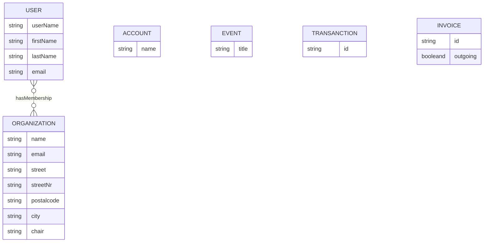

# Entity Relationship Diagram
Follow the link to get to the documentaion for mermaid.js to create diagrams in github https://mermaid.js.org/intro/

```mermaid
  erDiagram
    USER }o--o{ ORGANIZATION : hasMembership
    USER {
      string userName
      string firstName
      string lastName
      string email
    }
    ORGANIZATION {
      string name
      string email
      string street
      string streetNr
      string postalcode
      string city
      string chair
    }
    ACCOUNT {
      string name
    }
    EVENT {
      string title
    }
    TRANSANCTION {
      string id
    }
    INVOICE {
      string id
      booleand outgoing
    }
```
