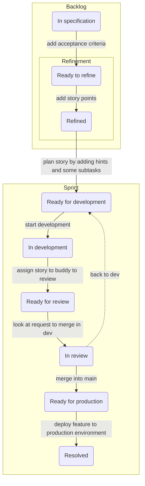
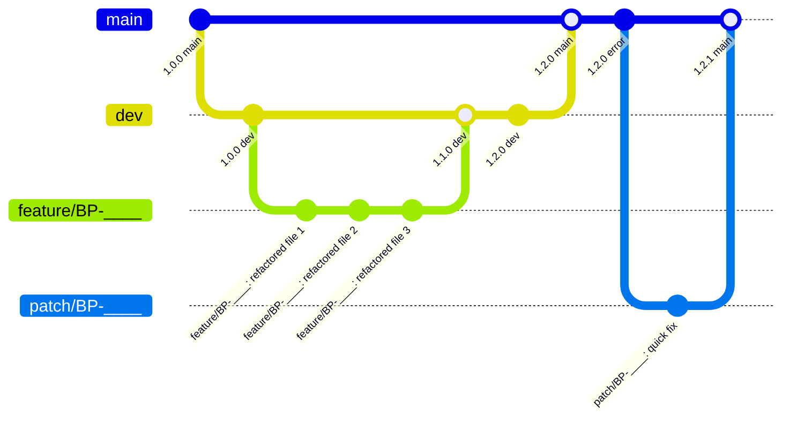

# club administration

## How to develop

### Development process

```mermaid
  flowchart TD
    subgraph Backlog
    A(In specification) -- add acceptance criteria --> B(Ready to refine)
    subgraph Refinement
    B-- add story points -->C(Refined)
    end
    end
    subgraph Sprint
    C-- plan story by adding hints and some subtasks -->D(Ready for development)
    D-- start development -->E(In development)
    E-- assign story to buddy to review -->F(Ready for review)
    F-- look at request to merge in dev -->G(In review)
    G-- merge into main -->H(Ready for production)
    H-- deploy feature to production environment -->I(Resolved)
    G-. back to dev .->D
    end
```
### Release process (git)

`major.minor.patch`

```mermaid
  gitGraph
       commit id: "1.0.0 main"
       branch dev
       commit id: "1.0.0 dev"
       branch feature/BP-____
       commit id: "feature/BP-____: refactored file 1"
       commit id: "feature/BP-____: refactored file 2"
       commit id: "feature/BP-____: refactored file 3"
       checkout dev
       merge feature/BP-____ id: "1.1.0 dev"
       commit id: "1.2.0 dev"
       checkout main
       merge dev id: "1.2.0 main"
       commit id: "1.2.0 error"
       branch patch/BP-____
       commit id: "patch/BP-____: quick fix"
       checkout main
       merge patch/BP-____ id: "1.2.1 main"
```
